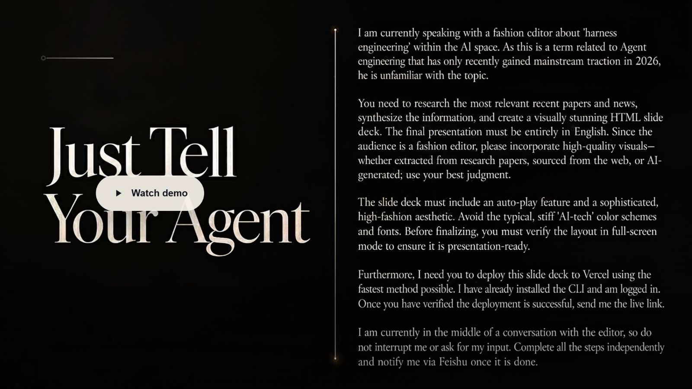

<p align="center">
  
</p>

# AgentVis

<p align="center">
  <a href="https://github.com/Muulor/AgentVis/releases/latest">Download for Windows</a> | <a href="README.zh-CN.md">中文 README</a>
</p>

<p align="center">
  
  
  
  
  
</p>

AgentVis is a local AI agent runtime platform built from the ground up. It brings agent planning, execution, tool calls, file editing, memory, skills, knowledge bases, visualization, sandboxing, security auditing, and human intervention into one governable desktop workspace. It is easy to install, requires no server deployment, starts quickly, and can be adapted to your own work scenarios.

Each Agent runs in an independent window, has full execution capabilities, and supports custom configuration. You do not need to repeatedly create, clear, or compress chat windows. Every Agent keeps enough context to work steadily on long-running or new tasks. After hundreds of conversation turns, you can still search or cite previous conversations, review your collaboration history, and reuse experience from difficult tasks you have already solved.

You can create multiple hubs as teams for different business contexts. Each hub can contain multiple Agents with different models, rules, roles, skills, knowledge bases, fact preferences, sandbox permissions, and scheduled tasks. Agents in different hubs can work on different task types at the same time without interfering with each other. You can also let Agents inspect each other's workspaces, follow related work, or share the same project directory as a common workspace.

Inside a hub, you can mention Agents with different roles and ask them to brainstorm from clean, role-specific perspectives. The discussion result can be cited back into an Agent window so that the Agent can continue the task with better context.

<p align="center">
  <a href="docs/User%20Guide/quick_start.en.md">Quick Start</a>
  -
  <a href="docs/User%20Guide/AgentVis%20Skill%20Usage%20Guide.en.md">Skill Guide</a>
  -
  <a href="docs/User%20Guide/AgentVis%20Sandbox%20Permissions%20and%20Security%20Audit%20Guide.en.md">Security Guide</a>
  -
  <a href="docs/User%20Guide/IM%20Bot%20Configuration%20Guide.en.md">IM Bot Guide</a>
</p>

## Demo Video

<p align="center">
  <a href="https://agentvis.muulor.workers.dev/assets/Harness-demo.mp4">
    
  </a>
</p>

<p align="center">
  <a href="https://agentvis.muulor.workers.dev/assets/Harness-demo.mp4">Click the cover to watch the demo</a>
</p>

## Core Capabilities

| Capability | Description |
| --- | --- |
| MB + SA multi-agent collaboration | The Master Brain decomposes tasks and dispatches work, while Sub-Agents execute concrete steps within dynamic tool allowlists. |
| Visual FSM runtime | Agent execution is split into states such as context preparation, master-brain decision, dispatch, observation, evaluation, and termination, all shown in real time in the UI. |
| Human-in-the-Loop | Users can pause an Agent at any execution step and use natural language to correct direction, add constraints, or change the plan. |
| Three-layer memory system | Short-term buffers, state summaries, long-term facts, and task experience together form cross-turn context. |
| RAG knowledge base | Parent-child chunking, embeddings, BM25, RRF fusion, and reranking support private document retrieval. |
| Fast Apply + Diff review | XML edit protocol, four-level content matching, Myers Diff, snapshots, and rollback make code edits reviewable and reversible. |
| Visualization enhancement | Responses in Task mode can be automatically enhanced into ECharts, Mermaid, and interactive widgets. |
| Vite live preview | React, Vue, and Vanilla frontend projects generated by Agents can be previewed in-app through a Vite dev server. |
| Scheduled tasks | Agents can run frequency-based or advanced Cron tasks automatically in Task mode. |
| Feishu / Slack remote control | Send tasks to Agents through IM messages, view progress in message cards, and stop execution at any time. |
| External Skill ecosystem | Supports both Guide and Script external skill packages, with AI-driven security review before installation. |
| Five-layer safety protection | LLM soft constraints, TypeScript tool interception, Rust command blocking, process/network sandboxing, and Trash Bin soft delete. |

## Who It Is For

- Developers who want to use local Agents as general-purpose assistants for daily work.
- Researchers or product teams exploring multi-agent collaboration, long-running task execution, and agent observability.
- Productivity tool users who need Agents connected to Feishu / Slack, scheduled tasks, browser automation, and office document processing.
- Open-source contributors who want to build or audit external Skills for AgentVis.

## Quick Start

### Use the Installer

The current release is mainly designed for Windows.

1. Download and install AgentVis from the [latest GitHub Release](https://github.com/Muulor/AgentVis/releases/latest).
2. On first launch, follow the initialization guide to configure API keys, cloud services, and preset skill dependencies. Then create a Hub and an Agent to start working.

For the full onboarding flow, see the [AgentVis Quick Start Guide](docs/User%20Guide/quick_start.en.md).

### Run from Source

Windows is recommended for development and runtime.

Requirements:

- Node.js 18 or later
- npm
- Rust stable toolchain
- Windows desktop build environment required by Tauri 2
- WebView2 Runtime
- Python 3.11 or later, used as a fallback runtime for external Script Skills during development

Install dependencies:

```powershell
npm install
```

Start the full Tauri desktop app:

```powershell
npm run tauri dev
```

Start only the Vite frontend:

```powershell
npm run dev
```

Build frontend assets:

```powershell
npm run build
```

Build the Tauri installer:

```powershell
npm run tauri build
```

Before Tauri packaging, AgentVis builds the Python runtime, frontend assets, and broker helper. The packaged resources include built-in Skills, native helper scripts, embedded Python, a prebuilt Python runtime, the Node bundle, and broker binaries.

## Security Model

AgentVis assumes by default that Agents can make mistakes and can be influenced by external content. Its security design is not a single confirmation dialog, but a continuous defense line from decision-making to execution.

| Layer | Location | Purpose |
| --- | --- | --- |
| 1. LLM behavior soft constraints | Prompt, FSM, Master Brain, Sub-Agent | Reduce the probability of unsafe decisions by injecting safety priorities, budgets, risk fields, and HITL checkpoints. |
| 2. TypeScript tool interception | Native Skill, Tool Guard, ExecSafetyPolicy | Classify risk, block blacklisted operations, and request checkpoint approval before tools are executed. |
| 3. Rust command blocking | `command_validator.rs`, shell commands | Block destructive system operations, protect paths, reject dangerous scripts, and prevent unacceptable commands. |
| 4. Process / network sandbox | `process_sandbox/`, broker, direct-audit | Control process lifetime, network egress, direct connection approval, and audit events based on sandbox level. |
| 5. Trash Bin soft delete | `trash_bin.rs` | Rewrite interceptable deletions into Trash Bin moves to reduce irreversible damage. |

User permission modes:

| Mode | Typical Use |
| --- | --- |
| Local audit mode | Default local Agent work, regular project development, and local automation. |
| Controlled network mode | Email, GitHub, cloud APIs, controlled browser automation, and tasks that need network access with auditing. |
| Offline isolation mode | Untrusted scripts, third-party Skills, high-risk commands, and tasks that require network isolation. |

Boundary note: Controlled network mode focuses on network egress consolidation and auditing. Not every direct connection from ordinary `exec` commands or Guide Skills is fully captured at the OS layer. For more complete network isolation boundaries, see the [Sandbox Permissions and Security Audit Guide](<docs/User Guide/AgentVis Sandbox Permissions and Security Audit Guide.en.md>) and the [ControlledNetwork regression matrix](<docs/AgentVis docs/AgentVis ControlledNetwork 回归矩阵.md>).

## Data and Privacy

- AgentVis is a local desktop app. Hubs, Agents, messages, files, memory, RAG indexes, snapshots, diffs, and Cron data are stored by default in a local SQLite database.
- API keys and some external service credentials are encrypted through Windows Credential Manager.
- LLM calls, embeddings, networked Skills, or user-configured cloud services send requests to the corresponding providers.
- When an Agent deletes files, AgentVis prefers moving them into the AgentVis Trash Bin for recovery and auditing.
- Users can export, import, and back up key data in settings.

## Tech Stack

| Layer | Technology |
| --- | --- |
| Desktop framework | Tauri 2 |
| Frontend | React 18, TypeScript, Vite 6 |
| State management | Zustand |
| UI foundation | Radix UI, Lucide React, CSS Modules |
| Visualization | ECharts, Mermaid, Widget Renderer |
| Backend | Rust, Tokio, Tauri Commands |
| Database | SQLite, sqlx, vector index interface |
| LLM gateway | OpenAI, Anthropic, Gemini, and compatible-provider adapters |
| Document processing | Rust-side DOCX, XLSX, PDF, PPTX parsing; external Skill Python runtime |
| Engineering quality | ESLint, TypeScript, Vitest, Husky, lint-staged |

## Project Structure

```text
AgentVis/
|-- docs/AgentVis docs/         # Core technical documentation
|-- docs/User Guide/            # User onboarding and configuration guides
|-- public/                     # Static app assets
|-- scripts/                    # Build and runtime helper scripts
|-- src/                        # React + TypeScript frontend source
|-- src-tauri/                  # Tauri + Rust backend source
|-- src-tauri/native-scripts/   # Native command helper scripts
|-- runtime-requirements-v1.txt # External Python runtime dependency list
|-- package.json                # npm scripts and frontend dependencies
|-- vite.config.ts              # Vite configuration
`-- vitest.config.ts            # Vitest configuration
```

For a source-code index, see [PROJECT_STRUCTURE.md](<docs/AgentVis docs/PROJECT_STRUCTURE.md>).

## Common Scripts

| Command | Purpose |
| --- | --- |
| `npm run dev` | Start the Vite frontend development server. |
| `npm run dev:broker-helper` | Build debug broker helper resources. |
| `npm run dev:sync-skills` | Sync built-in resources required by Tauri dev mode. |
| `npm run dev:tauri` | Build broker helper, sync resources, and start Vite for Tauri dev. |
| `npm run build` | Run `tsc`, then build with Vite. |
| `npm run build:python-runtime` | Build the Python runtime used by external Skills. |
| `npm run build:broker-helper` | Build release broker helper and WFP helper. |
| `npm run preview` | Preview Vite build output. |
| `npm run lint` | Run ESLint checks for TS/TSX files. |
| `npm run format` | Apply the repository Prettier baseline to its configured file set. |
| `npm run format:check` | Check the configured file set without rewriting files. |
| `npm run test:run` | Run Vitest once. |
| `npm run test:rust` | Run all Rust unit and integration test targets. |
| `npm run quality` | Run formatting, ESLint, TypeScript, and frontend test checks. |
| `npm run quality:full` | Run all quality checks, the frontend build, and Rust validation. |
| `npm run tauri <cmd>` | Call the Tauri CLI, for example `npm run tauri dev` or `npm run tauri build`. |

## Documentation Map

| Document | Content |
| --- | --- |
| [Quick Start](docs/User%20Guide/quick_start.en.md) | From first installation to model setup, cloud services, skill dependencies, Agent settings, and workspace configuration. |
| [Skill Usage Guide](<docs/User Guide/AgentVis Skill Usage Guide.en.md>) | Global skills, per-Agent skill binding, Guide / Script differences, and common troubleshooting. |
| [Sandbox Permissions and Security Audit Guide](<docs/User Guide/AgentVis Sandbox Permissions and Security Audit Guide.en.md>) | Local audit mode, controlled network mode, offline isolation, and security audit events. |
| [IM Bot Configuration Guide](<docs/User Guide/IM Bot Configuration Guide.en.md>) | Feishu and Slack bot configuration, so IM messages can trigger Agent tasks. |
| [Four Core Feature Deep Dive](<docs/AgentVis docs/features_deep_dive.en.md>) | Visualization enhancement, live preview, Cron, and IM channel deep dives. |
| [MB / SA Collaboration Mechanism](<docs/AgentVis docs/MB_SA Collaboration Mechanism.en.md>) | The collaboration framework between Master Brain and Sub-Agents. |
| [Context Management Mechanism](<docs/AgentVis docs/Context Management Mechanism.en.md>) | MB / SA context, compression, Task Artifact, and HITL. |
| [LLM Token Budget Policy](<docs/AgentVis docs/LLM Token Budget Policy.en.md>) | Scenario output profiles, reasoning guards, provider fallback, and truncated tool-call safety. |
| [Memory Mechanism Introduction](<docs/AgentVis docs/Memory Mechanism Introduction.en.md>) | Three-layer memory, triggers, injection, and UI design. |
| [RAG Mechanism](<docs/AgentVis docs/RAG Mechanism.en.md>) | The RAG pipeline based on hybrid search and RRF. |
| [Skill Feature Technical Documentation](<docs/AgentVis docs/Skill Feature Technical Documentation.en.md>) | Native / External Skills, execution contracts, security review, and runtime. |
| [Diff and Fast Apply](<docs/AgentVis docs/Diff and Fast Apply Feature Technical Introduction.en.md>) | XML edit protocol, Diff, snapshots, and rollback. |
| [Agent Behavior Safety Guardrails](<docs/AgentVis docs/AgentVis Agent Behavior Safety Guardrails.en.md>) | Five-layer Agent behavior safety protection. |

## Contributing

AgentVis is an open-source project maintained by an individual developer, and many parts can still be improved. Issues, Discussions, and PRs are welcome. Fork this repository and create a branch. In an AI-native workflow, let your Agent first inspect the related feature documents and architecture documents, then use that context to help with development.

To keep Agent-related changes auditable, please follow these conventions:

- During normal feature work, format only files changed by the task. Run the global formatter only for an explicit formatting migration on a clean, dedicated `style/` or `chore/` branch, and do not mix business changes into that commit.
- After modifying TS/TSX files, run `eslint --fix --quiet` and Prettier on the changed files, then run `tsc --noEmit`. Run affected tests for behavioral changes.
- After modifying JS/MJS/CSS files, run Prettier on the changed files and verify affected scripts or UI behavior.
- After modifying Rust files, run `cargo check`; run affected Rust tests for behavioral changes.
- Before merging, run `npm run quality`. Before releases or broad refactors, run `npm run quality:full`.
- Treat `.gitattributes` as the source of truth for line endings and `.editorconfig` as the editor baseline. Avoid unrelated line-ending-only changes.
- Change Prettier versions or formatting rules only in dedicated `style/` or `chore/` commits.
- New feature components must include a header comment and be added to `PROJECT_STRUCTURE.md`.
- When adding or changing user-visible copy, Toast messages, error messages, chat bubble content, tool observations, or system/tool return messages that affect Agent decisions, prefer the existing i18n system instead of hardcoding Chinese or English.
- Internal logs and pure debug messages are not required to use i18n.
- For changes involving files, commands, network access, external Skills, credentials, or sandboxing, update the related security documentation or test notes as well.

Examples:

```powershell
npx eslint --fix --quiet src\path\to\changed-file.tsx
npx prettier --write src\path\to\changed-file.tsx
npx tsc --noEmit
npm run quality
cargo check --manifest-path src-tauri\Cargo.toml
```

- [GitHub Issues](https://github.com/Muulor/AgentVis/issues) - Bug reports and feature requests
- [GitHub Discussions](https://github.com/Muulor/AgentVis/discussions) - Questions and discussions

For questions or suggestions about AgentVis, contact muulor@gmail.com.

## FAQ

### Does AgentVis require a server deployment?

No. AgentVis is a Tauri desktop app, and its core data and execution environment are local. Feishu / Slack integration uses WebSocket long connections and does not require a public IP, webhook server, or reverse proxy.

### Is data uploaded to the cloud?

Conversation records, file operations, memory data, and the local database are stored locally by default. LLM calls, embeddings, networked Skills, or user-configured cloud services send requests to the corresponding providers.

### Which models does AgentVis support?

AgentVis has built-in support for OpenAI, Anthropic, Gemini, and multiple compatible-protocol providers. It also supports local custom API endpoints. Users can add custom models in settings.

### Can I develop my own Skill?

Yes. External Skills use `SKILL.md` to describe capabilities and execution contracts, and support both Guide and Script modes. Local packages and GitHub packages go through security review during import. After installation, they can be refreshed in settings.

### Why is Diff review needed?

Agents can write files. Diff review makes every change visible, accept/rejectable, and reversible through snapshots before it is written.

### Is AgentVis cross-platform?

The current product is mainly designed for Windows. Tauri itself is cross-platform, but this project has Windows-first design in sandboxing, Credential Manager, WFP, desktop automation, and parts of the runtime.

## License

This project is open-sourced under the [MIT License](LICENSE). You are welcome to use, modify, distribute, and contribute to AgentVis.
