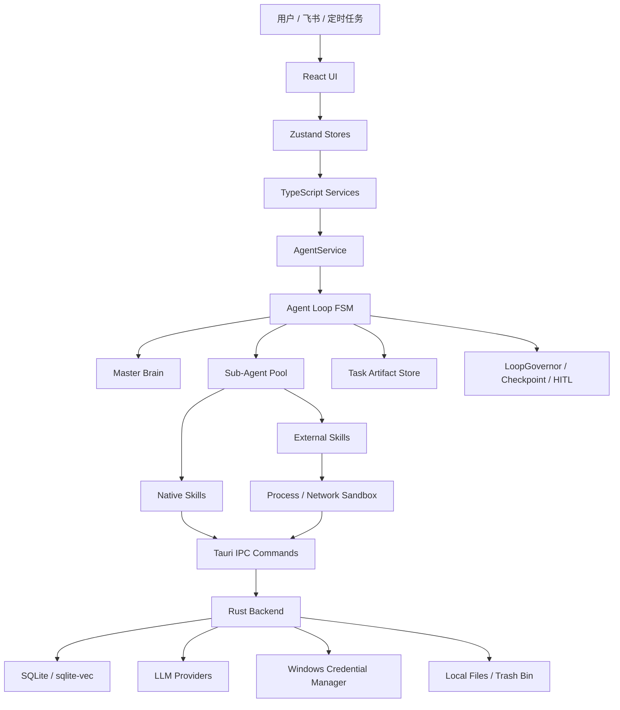

# AgentVis

AgentVis 是一个基于 Tauri、Rust 和 TypeScript 从零构建的本地 AI Agent 运行平台，把 Agent 的规划、执行、工具调用、记忆、可视化、沙箱、安全审计和人工介入统一到一个可治理的桌面工作空间中。易用免部署，一键安装秒速启动，每一个Agent都是独立窗口，拥有完整的执行能力并支持自定义的配置，无需反复创建会话窗口与清空会话，能成为你长期合作的伙伴。

## 目录

- [项目定位](#项目定位)
- [核心能力](#核心能力)
- [整体架构](#整体架构)
- [技术栈](#技术栈)
- [快速开始](#快速开始)
- [常用脚本](#常用脚本)
- [项目结构](#项目结构)
- [核心模块导览](#核心模块导览)
- [安全与沙箱模型](#安全与沙箱模型)
- [Skill 生态](#skill-生态)
- [模型与运行时](#模型与运行时)
- [数据与本地存储](#数据与本地存储)
- [质量规范](#质量规范)
- [技术文档索引](#技术文档索引)
- [FAQ](#faq)

## 项目定位

AgentVis 由三个层次组成：

1. 本地桌面工作空间：Hub、Agent、聊天、文件、Diff、记忆、技能、设置、可视化面板都在 Tauri WebView 中运行。
2. Agent 规划执行运行时：Master Brain 负责战略决策，Sub-Agent 负责受限工具执行，FSM、LoopGovernor、Checkpoint 和 HITL 共同约束长链路任务。
3. 安全与扩展底座：Rust 后端提供数据库、LLM 网关、文件与命令能力、沙箱策略、网络审计、Credential Manager 密钥存储和内嵌运行时。

适合的场景包括：

- 在本地环境中让 Agent 规划执行各类型任务，包括桌面自动化与浏览器自动化任务。
- 让多个 Agent 在同一个 Hub 中以不同角色协作，例如 BA、Architect、UX、Developer。
- 让 Agent 使用 RAG、长期记忆和任务经验持续理解用户偏好、背景和历史决策。
- 通过飞书/Slack远程下发任务，在消息卡片里查看思维链、Sub-Agent 进度并随时停止。
- 可以查看、创建、修改或删除多个不同时间、周期和内容的定时任务。

## 核心能力

| 能力 | 说明 |
| --- | --- |
| MB + SA 多智能体协同 | Master Brain 负责拆解任务和派遣，Sub-Agent 在动态工具白名单内执行具体步骤。 |
| FSM 可视化运行时 | 将 Agent 执行过程拆成准备上下文、主脑决策、派遣、观测、评估、终止等状态，前端可实时展示。 |
| Human-in-the-Loop | 用户可以在 Agent 执行的任意步骤主动暂停，用自然语言纠偏或追加约束。 |
| 三层记忆体系 | 短期缓冲、状态摘要、长期事实和任务经验共同组成跨轮上下文。 |
| RAG 知识库 | Parent-Child 分块、Embedding+Reranker、BM25、RRF 融合和上下文分配支撑私有文档召回。 |
| Fast Apply + Diff 审批 | XML 修改协议、四级内容匹配、Myers Diff、快照和回滚让代码改动可审阅、可撤销。 |
| 可视化增强 | Planning 回复可自动增强为 ECharts、Mermaid 和交互式 Widget。 |
| Vite 实时预览 | Agent 生成的 React、Vue、Vanilla 前端项目可在应用内启动 Vite Dev Server 预览。 |
| 定时任务 | Agent 可配置频率驱动或高级 Cron 任务，自动以 Planning 模式执行。 |
| 飞书/Slack远程控制 | WebSocket 长连接接入飞书/Slack，无需公网 Webhook 服务器，支持进度卡片和停止指令。 |
| 五层安全防护 | LLM 软约束、TS 工具拦截、Rust 命令硬阻断、进程/网络沙箱、Trash Bin 软删除。 |

## 整体架构



前端负责交互、状态和 Agent 编排；Rust 后端负责不可绕过的本地能力边界，包括数据库、文件、命令、LLM 请求、密钥、沙箱和审计。

## 技术栈

| 层 | 技术 |
| --- | --- |
| 桌面框架 | Tauri 2 |
| 前端 | React 18、TypeScript、Vite 6 |
| 状态管理 | Zustand |
| UI 基础 | Radix UI、Lucide React、CSS Modules |
| 可视化 | ECharts、Mermaid、Widget Renderer |
| 后端 | Rust、Tokio、Tauri Commands |
| 数据库 | SQLite、sqlx、向量索引接口 |
| LLM 网关 | OpenAI、Anthropic、Gemini 及兼容协议适配 |
| 文档处理 | Rust 侧 docx、xlsx、pdf、pptx 解析；外部 Skill Python 运行时 |
| 工程质量 | ESLint、TypeScript、Vitest、Husky、lint-staged |

## 快速开始

### 环境要求

建议在 Windows 上开发和运行：

- Node.js 18 或更高版本
- npm
- Rust stable toolchain
- Tauri 2 所需 Windows 桌面构建环境
- WebView2 Runtime
- Python 3.11 或更高版本，用于开发环境下的外部 Script Skill 运行时回退

首次安装依赖：

```powershell
npm install
```

只启动前端 Vite：

```powershell
npm run dev
```

启动完整 Tauri 桌面应用：

```powershell
npm run tauri dev
```

完整桌面开发模式会先构建 broker helper，再启动 Vite。Tauri 配置中的开发入口为 `http://localhost:1420`。

### 构建

构建前端产物：

```powershell
npm run build
```

构建 Tauri 安装包：

```powershell
npm run tauri build
```

Tauri 打包前会执行：

```powershell
npm run build:python-runtime
npm run build
npm run build:broker-helper
```

打包资源包含内置 Skills、嵌入式 Python、预构建 Python runtime、Node bundle 和 broker 二进制。

## 常用脚本

| 命令 | 用途 |
| --- | --- |
| `npm run dev` | 启动 Vite 前端开发服务器。 |
| `npm run dev:broker-helper` | 构建调试版 broker helper 资源。 |
| `npm run dev:tauri` | 构建 broker helper 并启动 Vite，供 Tauri dev 使用。 |
| `npm run build` | `tsc` 检查后执行 Vite 构建。 |
| `npm run build:python-runtime` | 构建外部 Skill 使用的 Python runtime。 |
| `npm run build:broker-helper` | 构建 release 版 broker helper 和 WFP helper。 |
| `npm run preview` | 预览 Vite 构建产物。 |
| `npm run lint` | 对 TS/TSX 执行 ESLint 检查。 |
| `npm run test` | 启动 Vitest watch。 |
| `npm run test:run` | 执行一次 Vitest 测试。 |
| `npm run test:coverage` | 执行 Vitest 覆盖率。 |
| `npm run tauri <cmd>` | 调用 Tauri CLI，例如 `npm run tauri dev`、`npm run tauri build`。 |

## 项目结构

```text
AgentVis/
├─ docs/AgentVis docs/        # 技术文档
├─ public/                    # 应用静态资源
├─ scripts/                   # 构建和 runtime 辅助脚本
├─ src/                       # React + TypeScript 前端源码
├─ src-tauri/                 # Tauri + Rust 后端源码
├─ website/                   # 官网静态页
├─ runtime-requirements-v1.txt # 外部 Python runtime 依赖清单
├─ package.json               # npm 脚本和前端依赖
├─ vite.config.ts             # Vite 配置
└─ vitest.config.ts           # Vitest 配置
```

前端关键目录：

```text
src/
├─ components/       # Agent、Chat、Diff、File、Hub、Memory、Settings、Widgets 等 UI
├─ config/           # 模型和供应商注册表
├─ hooks/            # 聊天发送、附件、Planning、主题等 React Hooks
├─ i18n/             # 中英文语言包和运行时翻译入口
├─ services/         # Agent、Memory、RAG、Fast Apply、Preview、Cron、IM、Attachment 等业务层
├─ stores/           # Zustand 状态管理
├─ styles/           # 全局样式和 token
├─ types/            # 共享 TypeScript 类型
└─ utils/            # 通用工具函数
```

Rust 后端关键目录：

```text
src-tauri/
├─ src/
│  ├─ commands/      # Tauri IPC 命令，包含文件、LLM、RAG、Memory、Shell、Sandbox 等
│  ├─ crypto/        # Credential Manager 密钥存储
│  ├─ db/            # SQLite 仓储层
│  ├─ llm/           # OpenAI / Anthropic / Gemini 适配
│  └─ bin/           # broker helper、WFP helper、测试探针
├─ skills-bundle/    # 内置外部 Skill 包
├─ python-embed/     # 嵌入式 Python 资源
├─ node-bundle/      # 嵌入式 Node 资源
└─ tests/            # Rust 集成测试
```

更细的源码索引见 [PROJECT_STRUCTURE.md](<docs/AgentVis docs/PROJECT_STRUCTURE.md>)。

## 核心模块导览

### Planning Runtime

入口位于 `src/services/planning/`。`AgentService` 是 UI 与 AgentLoop 的桥接层，负责加载记忆和 RAG，上下文准备，创建 AgentLoop，并把进度、Diff、HITL、Sub-Agent observation 等事件回传 UI。

核心机制：

- `MasterBrain` 只做决策，不直接执行动作。
- `Sub-Agent` 使用 ReAct 原子循环，在白名单工具内完成具体任务。
- `LoopGovernor` 检测无进展、工具震荡、过度派遣、预算耗尽。
- `TaskArtifactStore` 保存跨 SA 的搜索、文件、命令和用户介入成果。
- `FSMTracer`、`DecisionLogger`、`ThoughtVisualizer` 支撑观测性和前端可视化。

参考文档：[MB_SA_协同工作机制.md](<docs/AgentVis docs/MB_SA_协同工作机制.md>)、[上下文管理机制.md](<docs/AgentVis docs/上下文管理机制.md>)。

### Memory

入口位于 `src/services/memory/` 和 `src/components/memory/`。记忆系统不是简单追加聊天历史，而是三层结构：

- 短期缓冲：滑动窗口和水位线压缩，减少对话膨胀。
- 状态摘要：记录 topics、decisions、open questions，并支持语义召回。
- 长期事实：通过候选扫描、事实抽取和稳定性验证后写入。
- 任务经验：以 `task_experience` 形式进入 Master Brain 决策链。

参考文档：[记忆机制介绍.md](<docs/AgentVis docs/记忆机制介绍.md>)。

### RAG

入口位于 `src/services/rag/`。AgentVis 的 RAG 使用 Hybrid Search + RRF 融合：

- `DocumentChunker` 实现 Parent-Child 两级分块。
- `EmbeddingService` 调用云端 embedding 并带 LRU 缓存。
- `RerankService.ts` 对 RRF 候选池做二阶段语义重排与低分过滤
- `BM25Index` 提供内存关键词检索。
- `HybridRetriever` 融合向量 TopK 和 BM25 TopK。
- `ContextProvider` 将召回结果格式化注入 Prompt。

参考文档：[Rag机制.md](<docs/AgentVis docs/Rag机制.md>)。

### Fast Apply 与 Diff

入口位于 `src/services/fast-apply/` 和 `src/components/diff/`。它为 Agent 写文件提供可审阅的中间层：

- XML 修改协议描述 insert、replace、delete 等操作。
- `ContentMatcher` 支持精确、归一化、模糊和语义四级匹配。
- `MyersDiff` 构建行级差异。
- `SnapshotManager` 和 Rust snapshot 命令支持回滚。
- Diff UI 允许用户逐项接受或拒绝改动。

参考文档：[Diff 与 Fast Apply 功能技术介绍.md](<docs/AgentVis docs/Diff 与 Fast Apply 功能技术介绍.md>)。

### Visual Enhancer 与 Widgets

入口位于 `src/services/planning/visual-enhancer/`、`src/components/file/MarkdownRenderer.tsx` 和 `src/components/widgets/`。当 Planning 回复适合可视化时，系统可将文本增强为：

- ECharts 图表
- Mermaid 流程图
- `widget-choices` 选项组件
- `widget-chart` 信息图组件
- `widget-tree` 决策树组件

增强失败时无声降级，保留原始回复，不影响主流程。

参考文档：[features_deep_dive.md](<docs/AgentVis docs/features_deep_dive.md>)。

### Preview

入口位于 `src/services/preview/` 和 `src/components/file/LivePreviewPanel.tsx`。Agent 生成多文件前端项目后，AgentVis 可以在应用内启动 Vite Dev Server：

- 支持 `vanilla`、`react-tailwind`、`vue-tailwind` 模板。
- 端口范围默认 3100-3199。
- Windows Junction 复用模板依赖，减少重复安装。
- CSS 写入时可做 Tailwind v4 到 v3 的兼容降级。
- Dev server 绑定 localhost，并在面板关闭或应用退出时清理进程。

### Cron

入口位于 `src/services/cron/`、`src/components/agent/CronSettingsTab.tsx` 和 Rust `cron.rs` 命令。它支持：

- 频率驱动 UI 和高级 Cron 表达式。
- 每 60 秒轮询启用任务。
- 防重入执行集合。
- 定时任务统一进入 Planning 模式。
- 一次性任务执行后自动关闭。

### IM Channel

入口位于 `src/services/im-channel/` 和 `src/components/settings/ImChannelSettings.tsx`。当前主要支持飞书和 Slack：

- WebSocket 长连接，无需公网 Webhook 服务器。
- Rust 后端代理飞书 API，绕过 WebView CORS 限制。
- 消息、图片和文件可转为 Agent prompt 附件。
- 进度卡片按 2 秒节流更新。
- 支持 `/stop`、`停止`、`终止`、`取消` 中断任务。

### Attachment 与文档处理

入口位于 `src/services/attachment/` 和 Rust `document_parser.rs`。支持常见附件解析和压缩，包括文本、Markdown、PDF、DOCX、XLSX、PPTX 和图片。

## 安全与沙箱模型

AgentVis 的安全设计基于一个前提：Agent 可以做真实文件、命令和网络操作，因此每层都需要边界。

### 五层纵深防御

| 层 | 位置 | 作用 |
| --- | --- | --- |
| 1. LLM 行为软约束 | Prompt、FSM、Master Brain、Sub-Agent | 降低危险决策概率，注入安全优先级、预算、风险字段和 HITL。 |
| 2. TypeScript 工具拦截 | Native Skill、Tool Guard、ExecSafetyPolicy | 在工具落地前进行风险分级、黑名单阻断和 Checkpoint 审批。 |
| 3. Rust 命令硬阻断 | `command_validator.rs`、shell 命令 | 拦截系统破坏、保护路径、危险脚本和不可接受命令。 |
| 4. 进程 / 网络沙箱 | `process_sandbox/`、broker、direct-audit | 根据沙箱档位控制进程生命周期、网络出口、直连授权和审计。 |
| 5. Trash Bin 软删除 | `trash_bin.rs` | 将可拦截删除改写为回收站移动，降低不可逆破坏半径。 |

### 三档用户权限

| 模式 | 后端值 | 文件边界 | 网络边界 | 典型用途 |
| --- | --- | --- | --- | --- |
| 本机审计模式 | `LocalAudit` | 不限制在 workdir，但保留保护路径、脚本扫描、Trash Bin 和审计。 | 继承系统网络。 | 默认 Agent 工作、本机自动化、常规项目开发。 |
| 受控联网模式 | `ControlledNetwork` | 当前默认本机文件空间，沿用保护路径和 Trash Bin。 | HTTP(S) broker-proxy-preferred + 审计；Script `brokerOnly` fail-closed；非 HTTP(S) direct-audit。 | 邮件、GitHub、云 API、已有 CLI / Skill token cache、受控浏览器自动化。 |
| 离线隔离模式 | `OfflineIsolated` | AppContainer / workdir scope，runtime 和 skills roots 额外授权。 | deny-all，脚本网络命令和 API 硬阻断。 | 不可信脚本、第三方 Skill、高风险命令。 |

注意：当前受控联网模式强调网络出口收口和审计，不宣称所有普通 `exec` 或 Guide Skill 的直连都已经被 OS 层完整捕获。WFP 属于高级或实验增强入口。

参考文档：[AgentVis Agent 行为安全防护机制.md](<docs/AgentVis docs/AgentVis Agent 行为安全防护机制.md>)、[AgentVis 沙箱机制功能文档.md](<docs/AgentVis docs/AgentVis 沙箱机制功能文档.md>)、[AgentVis ControlledNetwork 回归矩阵.md](<docs/AgentVis docs/AgentVis ControlledNetwork 回归矩阵.md>)。

## Skill 生态

Skill 是 AgentVis Sub-Agent 的能力扩展单元。每个 Skill 通过 `SKILL.md` 描述元数据、触发规则、使用手册和执行合约。

### 原生 Skill

原生 Skill 位于 `src/services/planning/skills/`，构建时随前端产物内嵌：

- `exec`：执行 shell 命令。
- `read`：读取文件。
- `file_write`：写文件，并接入 Fast Apply / Diff。
- `web_search`：网络搜索。
- `local_search`：本地 grep、find、outline、symbol 搜索。
- `cron`：管理定时任务。
- `generate_image`：生成图片。
- `im_send`：通过已配置飞书或 Slack Bot 主动发送文本、图片和文件。

### 外部 Skill

外部 Skill 支持两种模式：

- Guide 模式：`SKILL.md` 是给 LLM 的能力说明书，由 Agent 自主选择执行路径。
- Script 模式：`SKILL.md` 包含 Execution Contract，框架按严格参数调用脚本。

内置 Skill 包位于 `src-tauri/skills-bundle/`，包括浏览器、桌面控制、文档、表格、PPT、GitHub 查询、arXiv、新闻、财经、视频处理、Skill 创建等能力。

用户安装的外部技能包会存放在应用数据目录的 `skills/external/packages/` 下，并可在设置页刷新生效。导入本地包或 GitHub 包时会经过 AI 驱动的安全审查。

参考文档：[Skill 功能技术文档.md](<docs/AgentVis docs/Skill 功能技术文档.md>)。

## 模型与运行时

### 模型供应商

模型和供应商统一由 `src/config/modelRegistry.ts` 管理。内置供应商包括：

- OpenAI
- Anthropic
- Google AI / Gemini
- ZhipuAI
- DeepSeek
- Agnes AI
- StepFun
- Xiaomi MiMo
- MiniMax
- Volcengine
- OpenRouter
- Local

`local` 供应商可配置自定义 base URL，并按模型 ID 自动推断 OpenAI、Anthropic 或 Gemini 协议。

用户自定义模型存储在应用数据目录的 `model-config.json` 中。供应商列表固定，对应 Rust 端 LLM 路由；模型列表可由用户扩展。

### Python Runtime

外部 Script Skill 使用共享 Python runtime。Windows 安装包会预打包 Python 3.13.14 runtime；开发环境或内嵌资源不可用时，可回退到 Python 3.11+。基础依赖见 [runtime-requirements-v1.txt](runtime-requirements-v1.txt)，包含：

- 网络请求：`requests`、`httpx`、`curl_cffi`
- 文档处理：`pypdf`、`python-docx`、`python-pptx`、`openpyxl`
- 数据分析：`numpy`、`pandas`
- 可视化：`matplotlib`、`plotly`、`pillow`
- 模板与配置：`jinja2`、`pyyaml`、`python-dotenv`

Script Skill 的额外依赖会增量安装。

### Node Runtime

应用会在打包资源中携带 Node bundle。实时预览服务会检查 Node 环境，并用模板缓存和 Windows Junction 复用依赖。

## 数据与本地存储

AgentVis 是本地桌面应用，核心数据默认存储在 Tauri 的应用数据目录：

- `agentvis.db`：SQLite 主数据库，保存 Hub、Agent、消息、文件、记忆、RAG 索引元数据、快照、Diff、Cron 等。
- `model-config.json`：用户自定义模型配置。
- `skills/external/packages/`：用户安装的外部 Skill 包。
- `logs/agentvis.log`：Rust 后端日志，受 `AGENTVIS_LOG` 控制。
- IM 附件、Skill runtime、预览项目和交付物目录由对应服务按需创建。

API Key 和部分外部服务凭据通过 Rust `crypto/keystore.rs` 存入 Windows Credential Manager，避免明文写入普通配置文件。

可通过环境变量调整日志级别：

```powershell
$env:AGENTVIS_LOG = "debug"
npm run tauri dev
```

可选值包括 `off`、`error`、`warn`、`info`、`debug`、`trace`。

## 质量规范

本项目使用 ESLint、Husky、lint-staged、i18n。请遵守以下规则：

- 修改 TS/TSX 后，只对改动文件运行 `eslint --fix --quiet`，并运行 `tsc --noEmit`。
- 修改 Rust 后运行 `cargo check`。
- 不运行全局 formatter；只处理改动文件。
- 新建功能组件需要添加头文件注释并更新到PROJECT_STRUCTURE.md。
- 新增或修改用户可见文案、Toast、错误提示、聊天气泡内容、工具 observation、会影响 Agent 决策的系统/工具返回消息时，优先接入现有 i18n。
- 内部日志和纯调试信息不强制 i18n。

示例：

```powershell
npx eslint --fix --quiet src\path\to\changed-file.tsx
npx tsc --noEmit
cargo check --manifest-path src-tauri\Cargo.toml
```

测试命令：

```powershell
npm run test:run
cargo test --manifest-path src-tauri\Cargo.toml
```

## 技术文档索引

核心技术文档位于 `docs/AgentVis docs/`：

| 文档 | 内容 |
| --- | --- |
| [PROJECT_STRUCTURE.md](<docs/AgentVis docs/PROJECT_STRUCTURE.md>) | 完整目录结构和关键源码索引。 |
| [features_deep_dive.md](<docs/AgentVis docs/features_deep_dive.md>) | 可视化增强、实时预览、Cron、IM 通道深度解析。 |
| [IM 机器人配置指南.md](<docs/AgentVis docs/IM 机器人配置指南.md>) | 飞书与 Slack 机器人创建、权限、事件订阅和 AgentVis 凭据填写指南。 |
| [MB_SA_协同工作机制.md](<docs/AgentVis docs/MB_SA_协同工作机制.md>) | Master Brain 与 Sub-Agent 协同执行框架。 |
| [上下文管理机制.md](<docs/AgentVis docs/上下文管理机制.md>) | MB/SA 上下文、压缩、Task Artifact 和 HITL。 |
| [记忆机制介绍.md](<docs/AgentVis docs/记忆机制介绍.md>) | 三层记忆、触发、注入和 UI 设计。 |
| [Rag机制.md](<docs/AgentVis docs/Rag机制.md>) | Hybrid Search + RRF 的 RAG 管线。 |
| [Skill 功能技术文档.md](<docs/AgentVis docs/Skill 功能技术文档.md>) | Native / External Skill、执行合约、安全审查和 runtime。 |
| [Diff 与 Fast Apply 功能技术介绍.md](<docs/AgentVis docs/Diff 与 Fast Apply 功能技术介绍.md>) | XML 修改协议、Diff、快照和回滚。 |
| [AgentVis Agent 行为安全防护机制.md](<docs/AgentVis docs/AgentVis Agent 行为安全防护机制.md>) | 五层 Agent 行为安全防护。 |
| [AgentVis 沙箱机制功能文档.md](<docs/AgentVis docs/AgentVis 沙箱机制功能文档.md>) | 三档沙箱、网络、审计、direct-audit 和回归边界。 |
| [AgentVis ControlledNetwork 回归矩阵.md](<docs/AgentVis docs/AgentVis ControlledNetwork 回归矩阵.md>) | 受控联网模式手工回归矩阵。 |

## FAQ

### AgentVis 需要部署服务器吗？

不需要。AgentVis 是 Tauri 桌面应用，核心数据和执行环境都在本机。飞书集成使用 WebSocket 长连接，不需要公网 IP、Webhook 服务器或反向代理。

### 数据会上传到云端吗？

对话记录、文件操作、记忆数据和本地数据库默认保存在本机。LLM 调用、Embedding、联网 Skill 或用户主动配置的云服务会向对应服务商发起请求；API Key 通过 Windows Credential Manager 加密存储。

### AgentVis 支持哪些模型？

内置支持 OpenAI、Anthropic、Gemini 及多个兼容协议供应商，也支持 Local 自定义 API 端点。用户可以在设置中添加自定义模型。

### 可以开发自己的 Skill 吗？

可以。外部 Skill 使用 `SKILL.md` 描述能力和执行合约，支持 Guide 和 Script 两种模式，推荐让Agent创建，安装后可在设置中刷新生效。

### 为什么需要 Diff 审批？

Agent 具备写文件能力，Diff 审批让每一处改动在写入前可见、可接受、可拒绝，并可通过快照回滚。

### 当前是否跨平台？

当前产品主要面向 Windows。Tauri 框架具备跨平台能力，但本项目的沙箱、Credential Manager、WFP、桌面自动化和部分运行时能力带有 Windows 优先设计。
