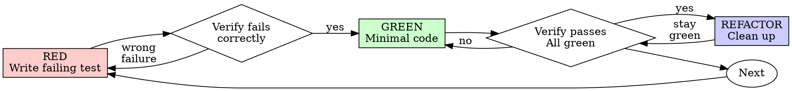

# Test-Driven Development (TDD)

## Overview

Write the test first. Watch it fail. Write minimal code to pass.

**Core principle:** If you didn't watch the test fail, you don't know if it tests the right thing.

Use TDD as a confidence tool for behavior-bearing code, not as ceremony for every file edit. When an automated test seam exists, prefer test-first because it defines the intended behavior before implementation bias appears.

## When to Use

**Required when practical:**
- New domain/business logic
- Bug fixes with reproducible behavior
- Refactoring that must preserve behavior
- Public API, data contract, persistence, or cross-component behavior changes

**Use targeted verification instead when TDD is not a good fit:**
- Visual/UI-only styling changes where screenshot or browser verification is the primary signal
- Configuration, documentation, or generated files
- Throwaway prototypes
- Glue code with no reasonable automated test seam
- Legacy areas where adding a test first would require unrelated large refactoring

When skipping TDD, record the reason and the alternative verification used in the handoff.

## The Working Rule

```
NO BEHAVIOR-BEARING PRODUCTION CODE WITHOUT A FAILING TEST FIRST WHEN A REASONABLE TEST SEAM EXISTS
```

If implementation already exists before the test, do not blindly delete shared work. Freeze the intended behavior, write a failing or characterization test that proves the gap, then adjust the implementation to satisfy the test. For isolated exploratory code, discard the spike and re-implement from tests when safe.

**Protect the intent:**
- The test must fail for the expected reason before the fix
- The test should assert behavior, not implementation details
- Keep exploratory code separate from the production patch

Implement the smallest production change that makes the test pass.

## Red-Green-Refactor



### RED - Write Failing Test

Write one minimal test showing what should happen.

<Good>
```typescript
test('retries failed operations 3 times', async () => {
  let attempts = 0;
  const operation = () => {
    attempts++;
    if (attempts < 3) throw new Error('fail');
    return 'success';
  };

  const result = await retryOperation(operation);

  expect(result).toBe('success');
  expect(attempts).toBe(3);
});
```
Clear name, tests real behavior, one thing
</Good>

<Bad>
```typescript
test('retry works', async () => {
  const mock = jest.fn()
    .mockRejectedValueOnce(new Error())
    .mockRejectedValueOnce(new Error())
    .mockResolvedValueOnce('success');
  await retryOperation(mock);
  expect(mock).toHaveBeenCalledTimes(3);
});
```
Vague name, tests mock not code
</Bad>

**Requirements:**
- One behavior
- Clear name
- Real code (no mocks unless unavoidable)

### Verify RED - Watch It Fail

**MANDATORY. Never skip.**

```bash
npm test path/to/test.test.ts
```

Confirm:
- Test fails (not errors)
- Failure message is expected
- Fails because feature missing (not typos)

**Test passes?** You're testing existing behavior. Fix test.

**Test errors?** Fix error, re-run until it fails correctly.

### GREEN - Minimal Code

Write simplest code to pass the test.

<Good>
```typescript
async function retryOperation<T>(fn: () => Promise<T>): Promise<T> {
  for (let i = 0; i < 3; i++) {
    try {
      return await fn();
    } catch (e) {
      if (i === 2) throw e;
    }
  }
  throw new Error('unreachable');
}
```
Just enough to pass
</Good>

<Bad>
```typescript
async function retryOperation<T>(
  fn: () => Promise<T>,
  options?: {
    maxRetries?: number;
    backoff?: 'linear' | 'exponential';
    onRetry?: (attempt: number) => void;
  }
): Promise<T> {
  // YAGNI
}
```
Over-engineered
</Bad>

Don't add features, refactor other code, or "improve" beyond the test.

### Verify GREEN - Watch It Pass

**MANDATORY.**

```bash
npm test path/to/test.test.ts
```

Confirm:
- Test passes
- Related tests still pass
- Output pristine (no errors, warnings)

**Test fails?** Fix code, not test.

**Other related tests fail?** Fix now. If unrelated tests fail, record the failure and avoid hiding it.

### REFACTOR - Clean Up

After green only:
- Remove duplication
- Improve names
- Extract helpers

Keep tests green. Don't add behavior.

### Repeat

Next failing test for next feature.

## Good Tests

| Quality | Good | Bad |
|---------|------|-----|
| **Minimal** | One thing. "and" in name? Split it. | `test('validates email and domain and whitespace')` |
| **Clear** | Name describes behavior | `test('test1')` |
| **Shows intent** | Demonstrates desired API | Obscures what code should do |

## Why Order Matters

**"I'll write tests after to verify it works"**

Tests written after code pass immediately. Passing immediately proves nothing:
- Might test wrong thing
- Might test implementation, not behavior
- Might miss edge cases you forgot
- You never saw it catch the bug

Test-first forces you to see the test fail, proving it actually tests something.

**"I already manually tested all the edge cases"**

Manual testing is ad-hoc. You think you tested everything but:
- No record of what you tested
- Can't re-run when code changes
- Easy to forget cases under pressure
- "It worked when I tried it" ≠ comprehensive

Automated tests are systematic. They run the same way every time.

**"I already wrote the code, so test-first is impossible"**

Do not let existing implementation dictate the test. Write the test from the requirement or bug reproduction, watch it fail or characterize the current wrong behavior, then align the code. If the existing code was only a spike, discard it before productionizing.

**"TDD is dogmatic, being pragmatic means adapting"**

TDD is pragmatic when behavior risk matters:
- Finds bugs before commit (faster than debugging after)
- Prevents regressions (tests catch breaks immediately)
- Documents behavior (tests show how to use code)
- Enables refactoring (change freely, tests catch breaks)

The pragmatic choice is to match verification strength to risk, and to document weaker verification when stronger tests are not practical.

**"Tests after achieve the same goals - it's spirit not ritual"**

No. Tests-after answer "What does this do?" Tests-first answer "What should this do?"

Tests-after are biased by your implementation. You test what you built, not what's required. You verify remembered edge cases, not discovered ones.

Tests-first force edge case discovery before implementing. Tests-after verify you remembered everything (you didn't).

30 minutes of tests after can still improve coverage, but it does not prove the test would have caught the original absence or bug. Prefer red-first for the next behavior change.

## Common Rationalizations

| Excuse | Reality |
|--------|---------|
| "Too simple to test" | Simple code breaks. Test takes 30 seconds. |
| "I'll test after" | Tests passing immediately prove nothing. |
| "Tests after achieve same goals" | Tests-after = "what does this do?" Tests-first = "what should this do?" |
| "Already manually tested" | Ad-hoc ≠ systematic. No record, can't re-run. |
| "I already wrote the code" | Write tests from requirements, not from the implementation. Discard isolated spike code when safe. |
| "Keep as reference, write tests first" | Only acceptable if the test is derived from requirements and still proves the gap. |
| "Need to explore first" | Fine. Keep the spike separate, then productionize with tests. |
| "Test hard = design unclear" | Listen to test. Hard to test = hard to use. |
| "TDD will slow me down" | It may for trivial changes; it usually saves time for risky behavior. |
| "Manual test faster" | Manual checks are useful for UI/visual validation, but weak for logic regressions. |
| "Existing code has no tests" | You're improving it. Add tests for existing code. |

## Red Flags - STOP and Re-Align

- Behavior code before a failing or characterization test
- Test written from implementation instead of requirement
- Test passes immediately
- Can't explain why test failed
- Tests postponed without recording alternative verification
- Rationalizing "just this once"
- "I already manually tested it"
- "Tests after achieve the same purpose"
- "It's about spirit not ritual"
- "Keep as reference" while copying implementation assumptions into the test
- "Already spent X hours, so we should trust it"
- "TDD is dogmatic" used to avoid any automated verification
- "This is different because..."

**All of these mean:** stop, restate the intended behavior, add or repair the test/verification plan, then continue.

## Example: Bug Fix

**Bug:** Empty email accepted

**RED**
```typescript
test('rejects empty email', async () => {
  const result = await submitForm({ email: '' });
  expect(result.error).toBe('Email required');
});
```

**Verify RED**
```bash
$ npm test
FAIL: expected 'Email required', got undefined
```

**GREEN**
```typescript
function submitForm(data: FormData) {
  if (!data.email?.trim()) {
    return { error: 'Email required' };
  }
  // ...
}
```

**Verify GREEN**
```bash
$ npm test
PASS
```

**REFACTOR**
Extract validation for multiple fields if needed.

## Verification Checklist

Before marking work complete:

- [ ] Every new or changed behavior has automated or explicitly documented verification
- [ ] Watched each relevant automated test fail before implementing when TDD was practical
- [ ] Each red test failed for expected reason (feature missing/bug reproduced, not typo)
- [ ] Wrote minimal code to pass each test
- [ ] Targeted tests/checks pass
- [ ] Output is clean or known unrelated failures are documented
- [ ] Tests use real code (mocks only if unavoidable)
- [ ] Edge cases and errors covered

Can't check all boxes? Record the gap in the handoff and strengthen verification before claiming high confidence.

## When Stuck

| Problem | Solution |
|---------|----------|
| Don't know how to test | Write wished-for API. Write assertion first. Ask your human partner. |
| Test too complicated | Design too complicated. Simplify interface. |
| Must mock everything | Code too coupled. Use dependency injection. |
| Test setup huge | Extract helpers. Still complex? Simplify design. |

## Debugging Integration

Bug found? Write a failing test or minimal reproduction before fixing when possible. Follow the TDD cycle for the fix. The test proves the fix and prevents regression.

Avoid fixing bugs without a test or reproduction note.

## Testing Anti-Patterns

When adding mocks or test utilities, avoid common pitfalls:
- Testing mock behavior instead of real behavior
- Adding test-only methods to production classes
- Mocking without understanding dependencies

## Final Rule

```
Behavior-bearing production code → failing/characterization test first when practical
Otherwise → document alternative verification and residual risk
```

Escalate to the master brain/user when verification is impossible or would require broad unrelated refactoring.
