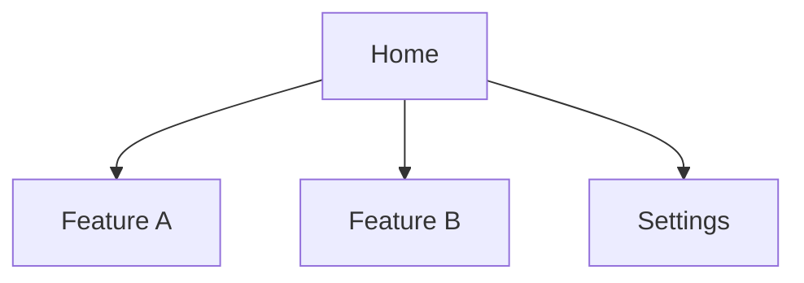
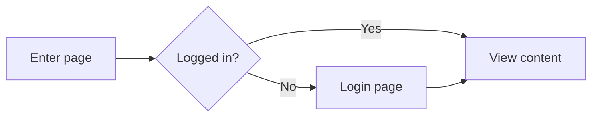

# UI-Spec Document Template

> **Usage Notes**: Fill in each section based on this template. Each section's `<!-- Guidance -->` comment explains what to include; delete the comments after filling them in.

---

# [Product/Feature Name] UI-Spec Specification Document

## 1. Document Information

| Field | Content |
|------|------|
| Version | v1.0 |
| Author | UX/UI Designer Agent |
| Date | [YYYY-MM-DD] |
| Status | Draft |
| Related PRD | [PRD version/link] |

---

## 2. Design System Overview

### 2.1 Design Principles

<!-- Guidance: Define 3-5 core design principles. Summarize each in one sentence + explain it in one sentence. Principles should serve the product positioning and user needs, not be generic statements. -->

1. **[Principle Name]** — [One-sentence explanation]
2. **[Principle Name]** — [One-sentence explanation]
3. **[Principle Name]** — [One-sentence explanation]

### 2.2 Visual Tone

<!-- Guidance: Clarify the visual direction and explain the rationale. You may reference style names from design-directions.md. -->

- **Style Direction**: [Style name]
- **Emotional Tone**: [Description]
- **Rationale**: [Why this style fits this product]
- **Reference Brands/Websites**: [List 2-3 references]

### 2.3 Design Tokens

#### Color System

<!-- Guidance: All colors must be defined through semantic Tokens. oklch() format is recommended. Define both Light and Dark values. -->

**Light Mode**:

| Token | Value | Usage |
|-------|-----|------|
| `color.bg.primary` | | Primary background |
| `color.bg.secondary` | | Secondary background/cards |
| `color.bg.tertiary` | | Tertiary background/floating layers |
| `color.text.primary` | | Primary text |
| `color.text.secondary` | | Secondary text |
| `color.text.muted` | | Supporting text/placeholders |
| `color.action.primary` | | Primary actions (buttons/links) |
| `color.action.primary.hover` | | Primary action hover state |
| `color.action.secondary` | | Secondary actions |
| `color.feedback.success` | | Success state |
| `color.feedback.warning` | | Warning state |
| `color.feedback.error` | | Error state |
| `color.feedback.info` | | Info state |
| `color.border.default` | | Default border |
| `color.border.focus` | | Focus border |

**Dark Mode**:

| Token | Value |
|-------|-----|
| `color.bg.primary` | |
| `color.text.primary` | |
| ... | |

#### Typography System

| Token | Font | Size/Line Height | Weight | Usage |
|-------|------|----------|------|------|
| `font.display` | | 48px / 1.1 | 700 | Hero title |
| `font.heading.xl` | | 36px / 1.2 | 700 | H1 |
| `font.heading.lg` | | 28px / 1.3 | 600 | H2 |
| `font.heading.md` | | 22px / 1.4 | 600 | H3 |
| `font.heading.sm` | | 18px / 1.4 | 600 | H4 |
| `font.body.lg` | | 18px / 1.6 | 400 | Long-form body text |
| `font.body.md` | | 16px / 1.6 | 400 | Default body text |
| `font.body.sm` | | 14px / 1.5 | 400 | Supporting text |
| `font.caption` | | 12px / 1.4 | 400 | Captions/footnotes |
| `font.mono` | | 14px / 1.5 | 400 | Code/data |

#### Spacing System

| Token | Value | Usage |
|-------|-----|------|
| `spacing.2xs` | 2px | Icon inner spacing |
| `spacing.xs` | 4px | Compact spacing |
| `spacing.sm` | 8px | Component inner spacing |
| `spacing.md` | 16px | Component spacing |
| `spacing.lg` | 24px | Paragraph spacing |
| `spacing.xl` | 32px | Section spacing |
| `spacing.2xl` | 48px | Large section spacing |
| `spacing.3xl` | 64px | Page-level spacing |

#### Radius and Shadows

| Token | Value | Usage |
|-------|-----|------|
| `radius.sm` | | Small elements (tags/badges) |
| `radius.md` | | Medium elements (buttons/inputs) |
| `radius.lg` | | Large elements (cards/modals) |
| `radius.full` | 9999px | Full round (avatars/pill buttons) |
| `shadow.sm` | | Slight elevation (default card state) |
| `shadow.md` | | Medium elevation (dropdown menus) |
| `shadow.lg` | | Strong elevation (modals/dialogs) |

#### Animation System

| Token | Value | Usage |
|-------|-----|------|
| `transition.fast` | 150ms ease | Immediate feedback (hover/press) |
| `transition.normal` | 250ms ease-out | Regular transitions (expand/collapse) |
| `transition.slow` | 400ms ease-out | Large-scale changes (page transitions) |
| `easing.enter` | cubic-bezier(0, 0, 0.2, 1) | Enter animation |
| `easing.exit` | cubic-bezier(0.4, 0, 1, 1) | Exit animation |
| `easing.spring` | cubic-bezier(0.34, 1.56, 0.64, 1) | Spring effect |

---

## 3. Information Architecture

### 3.1 Site Map

<!-- Guidance: Use a Mermaid diagram or indented list to show page hierarchy. -->



### 3.2 Navigation Structure

<!-- Guidance: Define navigation type (top/side/bottom tabs), navigation items, and hierarchy. -->

| Navigation Position | Type | Navigation Items |
|----------|------|--------|
| Top | Fixed navigation bar | [List items] |

### 3.3 Core User Flows

<!-- Guidance: Use Mermaid flowcharts to show the user operation paths for 1-3 core tasks. -->



---

## 4. Component Inventory

<!-- Guidance: List all UI components that need to be designed and define their state matrices. -->

### 4.1 Basic Components

| Component | Variants | States | Description |
|------|------|------|------|
| Button | Primary / Secondary / Ghost / Danger | Default / Hover / Active / Focus / Disabled / Loading | |
| Input | Text / Password / Search / Textarea | Default / Focus / Error / Disabled | |
| ... | | | |

### 4.2 Composite Components

| Component | Description | Child Components |
|------|------|-----------|
| | | |

---

## 5. Page Specifications

<!-- Guidance: Create a separate subsection for each core page and cover all dimensions below. -->

### 5.1 [Page Name]

#### Page Goal

<!-- Guidance: Explain in one sentence the core task users need to complete on this page. -->

#### Layout Specification

<!-- Guidance: Use an ASCII wireframe to express spatial relationships. Mark key dimensions and alignments. -->

```
┌──────────────────────────────────┐
│           HEADER / NAV           │
├──────────────────────────────────┤
│                                  │
│         [Core Content Area]       │
│                                  │
├──────────────────────────────────┤
│            FOOTER                │
└──────────────────────────────────┘
```

#### Component Usage Inventory

| Area | Component | State | Behavior Description |
|------|------|------|----------|
| | | | |

#### Interaction Specification

| Trigger | Behavior | Feedback |
|------|------|------|
| Click [element] | [Behavior description] | [Visual/audio feedback] |

#### Responsive Adaptation

- **Desktop (≥1024px)**:
- **Tablet (768-1023px)**:
- **Mobile (<768px)**:

#### Accessibility Requirements

- [ ] All interactive target sizes are ≥ 24×24px
- [ ] Focus states are visible and not obscured
- [ ] Color contrast is ≥ 4.5:1
- [ ] Keyboard navigation is supported
- [ ] Images/icons have alt text

<!-- Repeat the §5 structure to cover all core pages -->

---

## 6. Motion Specifications

### 6.1 Overall Motion Strategy

<!-- Guidance: Define the motion tone (restrained/lively/dramatic) and explain the rationale. -->

### 6.2 Transition Animations

| Scenario | Type | Duration | Easing Function | Description |
|------|------|------|----------|------|
| Page transition | | | | |
| Modal pop-up | | | | |
| List loading | | | | |

### 6.3 Microinteractions

| Trigger | Animation Effect | Token |
|------|----------|-------|
| Button Hover | | `transition.fast` |
| Card Hover | | `transition.fast` |
| Data loading | | `transition.normal` |

---

## 7. Dark Mode Specifications

<!-- Guidance: Explain Dark Mode Token mapping rules and special handling, such as how shadows should be adjusted in dark themes. -->

---

## 8. Sustainable Design Considerations

### 8.1 Performance Optimization Recommendations

- Images: lazy loading strategy and compression format recommendations
- Fonts: subset loading and FOUT/FOIT handling
- Animations: prioritize CSS transform/opacity (GPU acceleration)

### 8.2 Resource Conservation

- Provide Dark Mode by default (OLED power saving)
- Non-critical animations can be disabled by the system-level `prefers-reduced-motion`

---

## 9. Open Questions

<!-- Guidance: All design assumptions to be confirmed and items requiring user/PM feedback. -->

| # | Question | Design Assumption | Status |
|---|------|----------|------|
| 1 | | | Pending confirmation |

---

## 10. Appendix

### 10.1 Design Decision Log

<!-- Guidance: Record key design decisions and their rationale (why choose A instead of B). -->

| Decision | Options | Choice | Rationale |
|------|------|------|------|
| | A / B | | |

### 10.2 Glossary

| Term | Definition |
|------|------|
| | |
